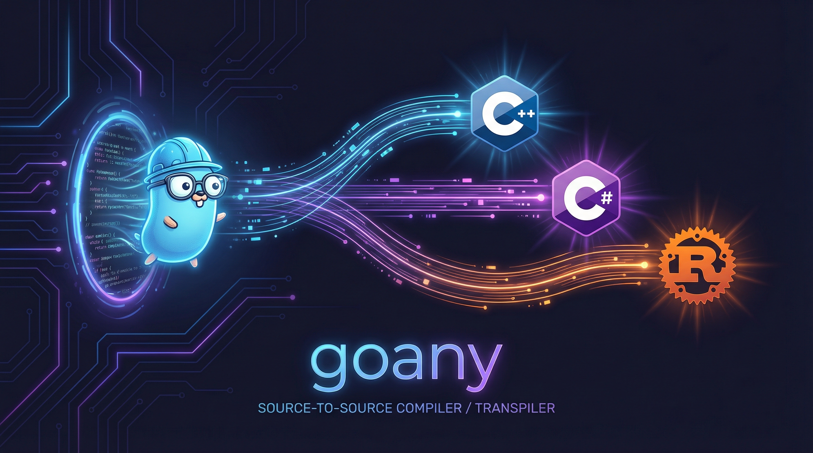

# goany



A Go language transpiler that generates portable code for multiple target platforms. Write your code once in Go and transpile it to C++, C#, or Rust.

## Overview

This project provides a foundation for writing portable libraries in Go that can be transpiled to multiple backend languages. Currently supported backends:

- **C++** - generates `.cpp` files
- **C#** - generates `.cs` files
- **Rust** - generates `.rs` files

## Building

To build the compiler:

```bash
cd cmd
make
```

### Make Targets

| Target | Description |
|--------|-------------|
| `make` | Build the project (default) |
| `make build` | Generate code, build astyle, and build goany binary |
| `make clean` | Clean all build artifacts |
| `make rebuild` | Clean and rebuild everything |
| `make dev` | Development build (with debug info) |
| `make prod` | Production build (optimized) |
| `make test` | Run tests |
| `make help` | Show all available targets |

## Usage

```bash
./goany -source=[directory] -output=[name] -backend=[backend]
```

### Flags

| Flag | Description | Default |
|------|-------------|---------|
| `-source` | Source directory containing Go files | (required) |
| `-output` | Output file name (without extension) | (required) |
| `-backend` | Backend(s) to use: `all`, `cpp`, `cs`, `rust` | `all` |
| `-link-runtime` | Path to runtime for linking (generates build files with include paths) | (none) |
| `-graphics-runtime` | Graphics backend: `tigr`, `sdl2`, `none` | `tigr` |
| `-debug` | Enable debug output | `false` |

The `-backend` flag accepts comma-separated values for multiple backends.

The `-graphics-runtime` flag selects the graphics library:
- `tigr` - Bundled, header-only library (C++ only, no external dependencies)
- `sdl2` - SDL2 library (requires SDL2 installed, supports all backends)
- `none` - No graphics support (for CLI applications)

### Examples

Transpile to all backends:
```bash
./goany -source=../examples/uql -output=uql
```

Transpile to Rust only:
```bash
./goany -source=../examples/uql -output=uql -backend=rust
```

Transpile to C# and Rust:
```bash
./goany -source=../examples/uql -output=uql -backend=cs,rust
```

Transpile graphics demo with tigr (default, C++ only):
```bash
./goany -source=../examples/graphics-demo -output=./build/graphics-demo -backend=cpp -link-runtime=../runtime
```

Transpile graphics demo with SDL2 (all backends):
```bash
./goany -source=../examples/graphics-demo -output=./build/graphics-demo -backend=rust -link-runtime=../runtime -graphics-runtime=sdl2
```

Transpile CLI app without graphics:
```bash
./goany -source=../examples/uql -output=./build/uql -link-runtime=../runtime -graphics-runtime=none
```

## Supported Features

### Types
- Primitive types: `int8`, `int16`, `int32`, `int64`, `uint8`, `uint16`, `uint32`, `uint64`
- `string`
- Slices: `[]T`
- Structs
- Function types

### Language Constructs
- Variable declarations and assignments
- Functions with multiple return values
- Structs with methods
- For loops (C-style and range-based)
- If/else statements
- Switch statements

### Limitations

Some Go features may not be fully supported due to differences in target platforms. See `cmd/doc/rust_backend_rules.md` for detailed implementation notes on the Rust backend.

## Runtime Libraries

### Graphics Runtime

A cross-platform 2D graphics library for window creation and drawing shapes. Two backends are available:

| Backend | Platforms | Dependencies | Notes |
|---------|-----------|--------------|-------|
| `tigr` | C++ only | None (bundled) | Default, header-only, lightweight |
| `sdl2` | C++, C#, Rust | SDL2 library | Hardware accelerated, full-featured |

**Setup SDL2 dependencies (only needed for `--graphics-runtime=sdl2`):**
```bash
./scripts/setup-deps.sh
```

**Example usage:**
```go
package main

import "myapp/graphics"

func main() {
    w := graphics.CreateWindow("Demo", 800, 600)

    running := true
    for running {
        w, running = graphics.PollEvents(w)
        graphics.Clear(w, graphics.Black())
        graphics.FillRect(w, graphics.NewRect(100, 100, 200, 150), graphics.Red())
        graphics.Present(w)
    }

    graphics.CloseWindow(w)
}
```

See [runtime/graphics/README.md](runtime/graphics/README.md) for full API documentation.

## Project Structure

```
goany/
├── cmd/                    # CLI entry point
│   ├── main.go            # Main entry point
│   ├── Makefile           # Build configuration
│   └── doc/               # Documentation
├── compiler/               # Compiler library
│   ├── rust_emitter.go    # Rust backend
│   ├── csharp_emitter.go  # C# backend
│   ├── cpp_emitter.go     # C++ backend
│   ├── base_pass.go       # Pass infrastructure
│   ├── emitter.go         # Emitter interface
│   └── astyle/            # Code formatting (CGO)
├── runtime/                # Runtime libraries
│   └── graphics/          # SDL2 graphics runtime
├── examples/               # Example projects
│   ├── uql/               # SQL query parser
│   ├── contlib/           # Container library
│   └── graphics-demo/     # Graphics demo
├── scripts/                # Utility scripts
│   └── setup-deps.sh      # Install dependencies
└── tests/                  # Test cases
```

## License

This project is a personal experiment for exploring language transpilation concepts.
