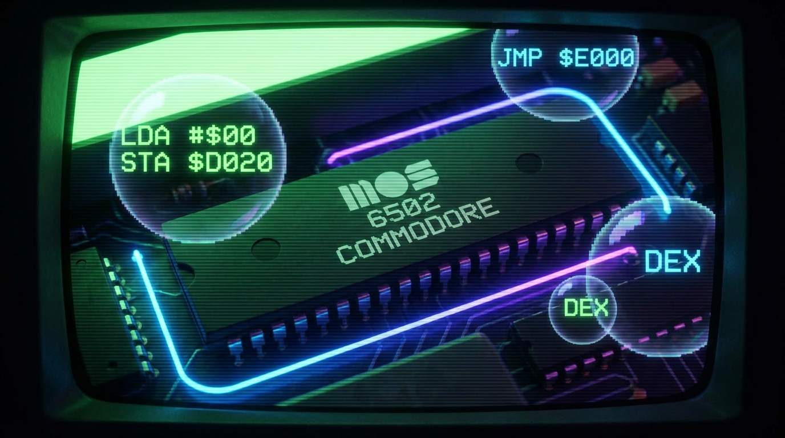

# MOS 6502 Emulator



A complete MOS 6502 CPU emulator with assembler, written in goany (Go subset that transpiles to C++/C#/Rust).

## Overview

This project implements:

- **CPU Emulator** - Full 6502 instruction set interpreter
- **Assembler** - Converts 6502 assembly to machine code
- **Graphics Display** - SDL2-based screen rendering
- **Demo Programs** - Various examples showcasing the emulator

## Features

### CPU Emulation

The emulator supports all official 6502 instructions:

| Category | Instructions |
|----------|-------------|
| Load/Store | LDA, LDX, LDY, STA, STX, STY |
| Arithmetic | ADC, SBC |
| Logical | AND, ORA, EOR |
| Shift/Rotate | ASL, LSR, ROL, ROR |
| Inc/Dec | INC, DEC, INX, INY, DEX, DEY |
| Compare | CMP, CPX, CPY, BIT |
| Branch | BPL, BMI, BVC, BVS, BCC, BCS, BNE, BEQ |
| Jump | JMP, JSR, RTS, RTI |
| Stack | PHA, PHP, PLA, PLP |
| Transfer | TAX, TXA, TAY, TYA, TSX, TXS |
| Flags | CLC, SEC, CLI, SEI, CLV, CLD, SED |
| Other | NOP, BRK |

### Addressing Modes

- Immediate: `LDA #$42`
- Zero Page: `LDA $42`
- Zero Page,X: `LDA $42,X`
- Zero Page,Y: `LDX $42,Y`
- Absolute: `LDA $1234`
- Absolute,X: `LDA $1234,X`
- Absolute,Y: `LDA $1234,Y`
- Accumulator: `ASL A`

## Demo Programs

### graphic

A simple graphics demo that draws pixels to a 32x32 display.

```bash
cd cmd/graphic && go run .
```

### text

Text rendering demo using a built-in font.

```bash
cd cmd/text && go run .
```

### textscroll

Scrolling text demonstration.

```bash
cd cmd/textscroll && go run .
```

### c64

Commodore 64-style emulator with:
- 40x25 character text screen
- C64 color palette
- Keyboard input support
- Classic "READY." prompt

```bash
cd cmd/c64 && go run .
```

## Building with goany

```bash
# From the cmd directory (goany root)
./goany --source=../examples/mos6502/cmd/c64 --output=build/c64 --link-runtime=../runtime

# Compile C++
cd build/c64 && make

# Or compile C#
cd build/c64 && dotnet build

# Or compile Rust
cd build/c64 && cargo build
```

## Project Structure

```
mos6502/
├── README.md
├── lib/
│   ├── cpu/
│   │   ├── cpu.go       # CPU emulator with all instructions
│   │   └── go.mod
│   ├── assembler/
│   │   ├── assembler.go # 6502 assembler
│   │   └── go.mod
│   └── font/
│       ├── font.go      # 8x8 bitmap font data
│       └── go.mod
└── cmd/
    ├── graphic/         # Graphics demo
    ├── text/            # Text rendering demo
    ├── textscroll/      # Scrolling text demo
    └── c64/             # C64-style emulator
```

## CPU API

```go
// Create a new CPU
c := cpu.NewCPU()

// Load a program at address $0600
c = cpu.LoadProgram(c, program, 0x0600)

// Execute until halted or max cycles
c = cpu.Run(c, 10000)

// Step one instruction
c = cpu.Step(c)

// Read/write memory
value := cpu.ReadByte(c, addr)
c = cpu.WriteByte(c, addr, value)
```

## Assembler API

```go
// Assemble a program from string
code := assembler.AssembleString(`
    LDA #$01
    STA $0200
    LDX #$00
loop:
    INX
    CPX #$10
    BNE loop
    BRK
`)

// Or from lines
lines := []string{
    "LDA #$42",
    "STA $0200",
    "BRK",
}
code := assembler.AssembleLines(lines)
```

## Memory Map

| Address | Description |
|---------|-------------|
| $0000-$00FF | Zero Page |
| $0100-$01FF | Stack |
| $0200-$05FF | Screen memory (32x32) |
| $0400-$07E7 | Text screen (C64 mode) |
| $0600+ | Program area |

## Example: Drawing a Pixel

```asm
; Draw a red pixel at position (5, 5)
LDA #$02        ; Color red
LDX #$05        ; X position
LDY #$05        ; Y position
; Calculate address: $0200 + (Y * 32) + X
; Store to screen memory
STA $02A5       ; $0200 + 5*32 + 5 = $02A5
BRK
```

## Prerequisites

- SDL2 library for display output
  - macOS: `brew install sdl2`
  - Ubuntu: `apt-get install libsdl2-dev`

## See Also

- [graphics-demo](../graphics-demo/) - Graphics runtime demonstration
- [6502 Reference](http://www.obelisk.me.uk/6502/reference.html) - 6502 instruction reference
