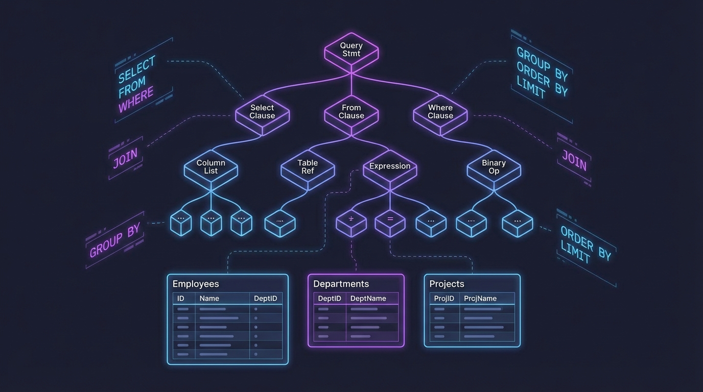

# UQL (Universal Query Language)



A SQL-like query language parser and AST implementation in goany (Go subset that transpiles to C++/C#/Rust).

## Overview

UQL demonstrates building a complete language frontend including:
- **Lexer** - Tokenizes input strings into tokens
- **Parser** - Builds an Abstract Syntax Tree (AST) from tokens
- **AST Walker** - Visitor pattern for traversing the AST

## Query Syntax

UQL uses a pipe-based syntax where intermediate results are assigned to variables:

```sql
t1 = from table1;
t2 = from table2;
t3 = join t1 t2 on t1.id == t2.id;
t4 = where t3.field1 > 10 && t3.field2 < 20;
t5 = orderby t4 t4.field1 desc t4.field2 asc;
t6 = limit t5 100;
t7 = groupby t4 t4.category count t4.id sum t4.amount;
t8 = select t6.field1;
```

### Supported Statements

- `from <table>` - Select data from a table
- `where <condition>` - Filter rows based on conditions
- `select <fields>` - Project specific fields
- `join <left> <right> on <condition>` - Join two tables
- `orderby <source> <field> [asc|desc]` - Sort results
- `limit <source> <count>` - Limit number of results
- `groupby <source> <fields> [aggregates]` - Group and aggregate data

### Supported Operators

- Comparison: `>`, `<`, `>=`, `<=`, `==`, `!=`
- Logical: `&&`, `||`

### Aggregate Functions

- `count <field>` - Count rows
- `sum <field>` - Sum values
- `avg <field>` - Average values
- `min <field>` - Minimum value
- `max <field>` - Maximum value

## Building

```bash
# From the cmd directory
./goany --source=../examples/uql --output=build/uql --link-runtime=../runtime

# Compile C++
cd build/uql && make

# Or compile C#
cd build/uql && dotnet build

# Or compile Rust
cd build/uql && cargo build
```

## Running

```bash
# C++
./uql

# C#
dotnet run

# Rust
cargo run
```

## Structure

```
uql/
├── main.go      # Main program with visitor implementation
├── go.mod       # Go module file
├── lexer/       # Lexical analysis
│   └── lexer.go # Token definitions and tokenizer
├── parser/      # Syntax analysis
│   └── parser.go # Parser implementation
└── ast/         # Abstract Syntax Tree
    └── ast.go   # AST node types and walker
```

## AST Visitor Pattern

The example demonstrates using the visitor pattern to traverse the AST:

```go
visitor := ast.Visitor{
    PreVisitFrom: func(state any, expr ast.From) any {
        // Called before visiting From node children
        return state
    },
    PostVisitFrom: func(state any, from ast.From) any {
        // Called after visiting From node children
        return state
    },
    PreVisitJoin: func(state any, join ast.Join) any {
        // Called before visiting Join node children
        return state
    },
    PostVisitJoin: func(state any, join ast.Join) any {
        // Called after visiting Join node children
        return state
    },
    // ... similar for Where, Select, OrderBy, Limit, GroupBy, LogicalExpr
}
```

## Example Output

```
1
From:
  t1
  table1
1
From:
  t2
  table2
4
Join:
  t3
  Left: t1
  Right: t2
  on: t1.id == t2.id
2
Where:
  t4
  t3.field1 > 10 && t3.field2 < 20
5
OrderBy:
  t5
  Source: t4
  Field: t4.field1 desc
  Field: t4.field2 asc
6
Limit:
  t6
  Source: t5
  Count: 100
7
GroupBy:
  t7
  Source: t4
  Field: t4.category
  Aggregate: count(t4.id)
  Aggregate: sum(t4.amount)
3
Select:
  t8
  t6.field1
```
